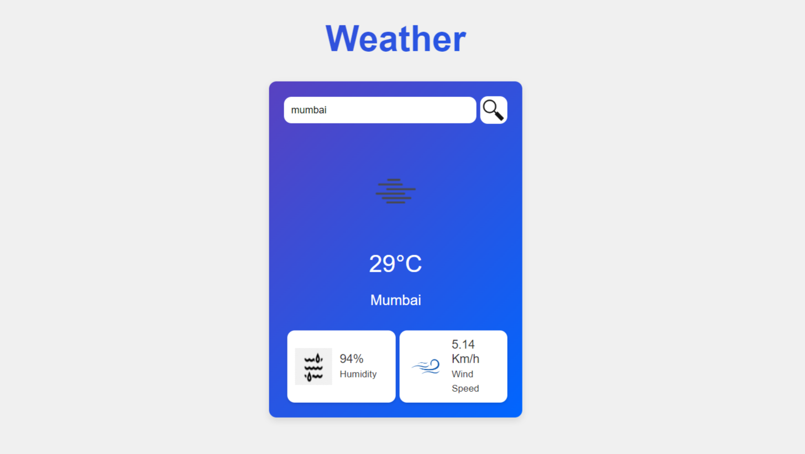

<h2 align="center">Weather Page</h2>
<p align="center">
An Awesome Web Application powered by the OpenWeather API to fetch Weather Data.
</p>

## Project Overview

This web application fetches current weather information based on user-provided location inputs. It provides real-time updates, including temperature, humidity, wind speed, and weather conditions.

Visit the deployed page at [Weather Page](https://weather-page-eight.vercel.app/) to see the live application in action.
For the code, visit GitHub at [Weather Page](https://github.com/kvskmurty2802/Weather_Page).





## Table of Contents

- [Features](#Features)
- [Installation](#Installation)
  - [Usage](#Usage)
- [Contributing](#Contributing)
- [Features](#Features)
- [Contact](#Contact)


## Features

- **Current Weather:** Displays current weather conditions for the specified location.
- **Responsive Design:** Optimized for various screen sizes, ensuring a seamless user experience.
- **API Integration:** Utilizes Open Weather API to fetch weather data.


## Installation

1. Clone the repository:
   ```bash
   git clone https://github.com/kvskmurty2802/WeatherPage.git

2. Navigate into the project directory:
   ```bash
    cd WeatherPage
   
3. Install dependencies:
   ```bash
    npm install

## Usage:

1. Obtain an API key from Open Weather API.

2. Create a .env file in the root directory and add your API key:
   ```bash
    API_KEY=your_api_key_here

3. Start the development server:
   ```bash
    npm start

4. Open your browser and visit below link to view the weather page.
   ```bash
    http://localhost:3000

## Contributing

Contributions are welcome! Please follow these steps:

1. Fork the repository.
   
2. Create a new branch (`git checkout -b feature/my-feature`).
   
3. Commit your changes (`git commit -am 'Add new feature'`).
   
4. Push to the branch (`git push origin feature/my-feature`).
   
5. Open a pull request.


## 🔝 Top Contributed Repositories

Here are some of my top contributed repositories:

[TheMovieDB](https://github.com/kvskmurty2802/TheMovieDB) - [](https://themoviedb-sigma.vercel.app/)

[Portfolio Page](https://github.com/kvskmurty2802/Portfolio_Page) - [](https://portfolio-page-nu-two.vercel.app/)

[Weather Page](https://github.com/kvskmurty2802/Weather_Page) - [](https://weather-page-eight.vercel.app/)


Feel free to explore these projects and contributions!

## Contact

GitHub Profile: [kvskmurty2802](http://github.com/kvskmurty2802/)

Contact me via [Email](mailto:krishnamurty2802@gmail.com).


## 💰 You can help me by Donating
[](https://buymeacoffee.com/kvskmurty2802) 
[](https://www.paypal.com/paypalme/kvskmurty2802/) 
